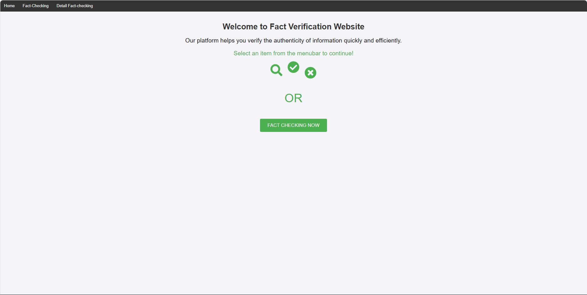

# Fact-Checking System

##Introduction
This project is an automated Fact-checking System designed to verify the accuracy of information by analyzing claims and comparing them against available data. The system leverages large language models and deep learning techniques to determine if a claim is supported, refuted, or if there is insufficient information.

## Features
- **Claim Verification**: The project identifies whether a claim is supported, refuted, or lacks sufficient information based on the dataset.
- **Evidence Retrieval**: Automatic evidence retrieval from various sources to aid the verification process.
- **Text and Table Data Analysis**: Combines transformer models for both text and tables, improving accuracy when processing complex data types.

## Architecture
The system is based on a Dual Transformer Architecture, including:

- Transformer for Text: Models like DeBERTaV3 or RoBERTa are used for encoding the context in text.
- Transformer for Tables: Models like TAPAS or TAPEX handle information extraction from tables.
- Cross-Attention Module: Allows the merging of information from text and tables to make accurate inferences.

## Technologies and Models Used

- Python: Primary programming language.
- Transformer Models: DeBERTaV3, RoBERTa, TAPAS, TAPEX.
- Attention Mechanism: Scaled Dot-Product Attention enables the system to analyze relationships between text and table data.
- Google Colab: Development and training environment.

## Installation
1. Clone the repository:
   ```sh
   git clone https://github.com/chuongprg-it/Fact-checking-.git 
   ``` 
2. Run the system for testing:
   ```sh
   python app.py
   ```

## Usage 

1. **User Interface**: Enter a claim in the search box, then select Fact-Check to start verification.
2. **Evidence Retrieval**: Use the Evidence Retrieval button to gather information from relevant documents and table data.
3. **Verification Results**: View classification results with probabilities for SUPPORTED, REFUTED, and NOT ENOUGH INFORMATION.

## Detail Training Model Fact-Checking

You can refer to how to train the fact-checking model in the following repo: https://github.com/chuongprg-it/Enhancing-FEVEROUS.git